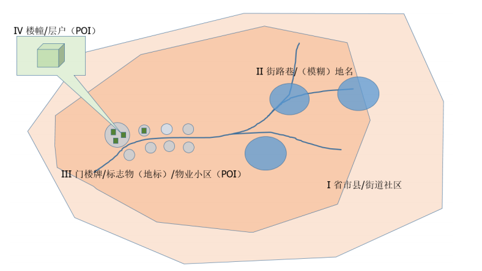

title: "产品"
date: 2015-04-05 05:37:40
type: "product"
---

## 地名地址检索服务

地名地址检索服务包括地名地址检索SDK核心服务和地名地址检索Facade行业应用服务。
### 	地名地址检索SDK核心服务
地名地址检索SDK提供地名地址检索的服务端接口的Java封装，与地名地址检索服务后台通信，方便开发者根据具体业务场景进行服务定制。
 
### 	地名地址检索SDK服务-接口文档
面向应用的地名地址检索Facade服务为对地名地址检索核心服务的REST封装，提供对地名地址进行批量正向解析和逆向解析等接口服务。
### 	地名地址检索Facade应用服务
面向应用的地名地址检索Facade服务为对地名地址检索核心服务的REST封装，提供对地名地址进行批量正向解析和逆向解析等接口服务。
  